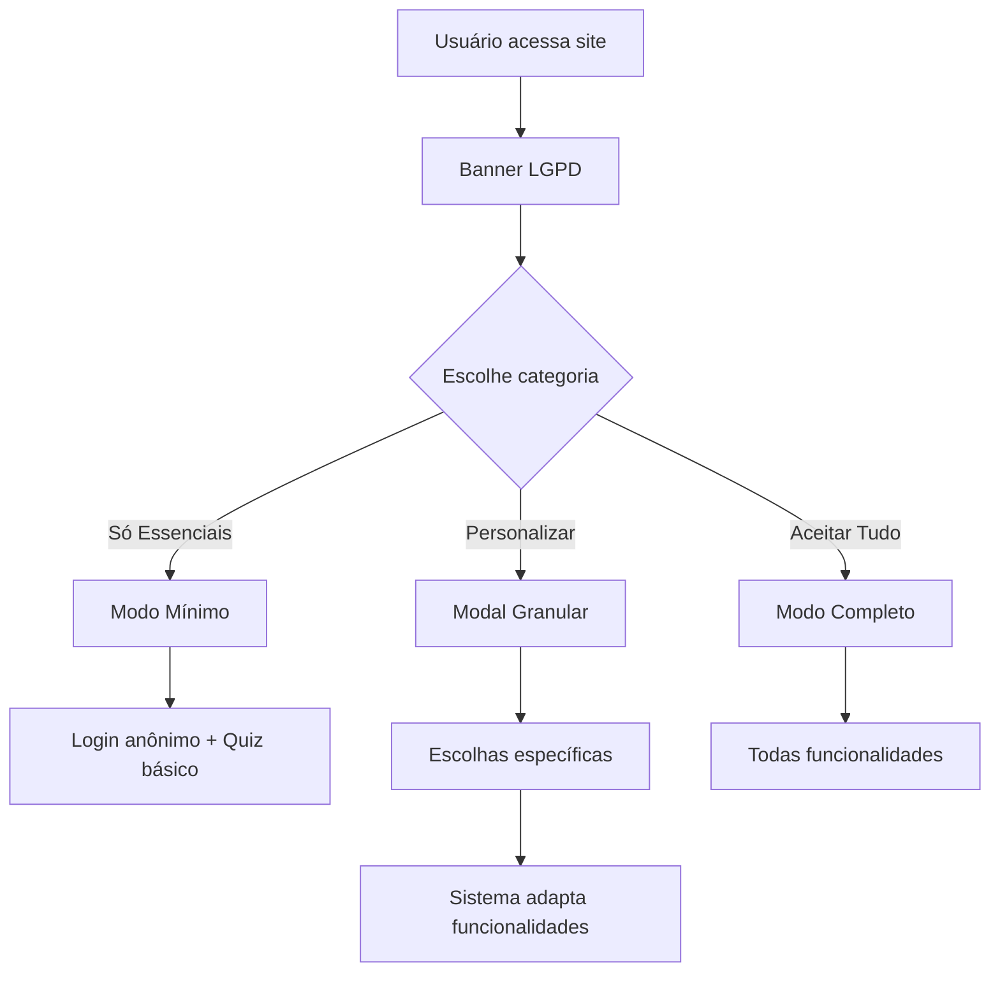

# 🔐 Análise LGPD - Sistema de Privacidade CyberGuard

## 🚨 **Problemas Identificados (Não Conformidade)**

### ❌ **1. Consentimento Insuficiente**
- **Problema**: Sistema coleta dados essenciais (nome, email, resultados) automaticamente
- **LGPD**: Art. 8º - Consentimento deve ser livre, informado e inequívoco
- **Solução**: Implementar consentimento granular real

### ❌ **2. Falta de Transparência**
- **Problema**: Usuário não sabe exatamente quais dados são coletados
- **LGPD**: Art. 9º - Transparência sobre finalidades e tratamento
- **Solução**: Modal explicativo detalhado

### ❌ **3. Ausência de Controle Real**
- **Problema**: Checkboxes de analytics/marketing não afetam coleta principal
- **LGPD**: Art. 18º - Direito de revogação do consentimento
- **Solução**: Sistema deve funcionar mesmo com dados mínimos

## ✅ **Implementação LGPD Correta**

### 🎯 **Categorias de Dados Reais:**

1. **ESSENCIAIS (Obrigatórios)**:
   - Autenticação básica (email criptografado)
   - Progresso mínimo do quiz (anônimo)
   
2. **FUNCIONAIS (Opcionais)**:
   - Nome para personalização
   - Histórico detalhado de quizzes
   - Participação no ranking
   
3. **ANALYTICS (Opcionais)**:
   - Tempo gasto em páginas
   - Padrões de uso
   - Estatísticas agregadas

4. **MARKETING (Opcionais)**:
   - Email para comunicações
   - Preferências de contato

### 🔧 **Fluxo LGPD Correto:**



### 📋 **Implementação Técnica:**

```javascript
// Estrutura LGPD Correta
const lgpdConsent = {
  essential: {
    required: true,
    description: "Autenticação básica e segurança",
    data: ["email_hash", "session_token"],
    legal_basis: "legítimo_interesse" // Art. 7º VI
  },
  
  functional: {
    required: false,
    description: "Personalização e histórico",
    data: ["nome", "quiz_results", "ranking_participation"],
    legal_basis: "consentimento" // Art. 7º I
  },
  
  analytics: {
    required: false,
    description: "Melhoria da plataforma",
    data: ["usage_patterns", "performance_metrics"],
    legal_basis: "consentimento"
  },
  
  marketing: {
    required: false,
    description: "Comunicações educacionais",
    data: ["email_contact", "preferences"],
    legal_basis: "consentimento"
  }
}
```

## 🎯 **Ações Necessárias:**

### 1. **URGENTE - Consentimento Real**
- ✅ Implementar coleta mínima por padrão
- ✅ Modal explicativo detalhado
- ✅ Funcionalidades adaptáveis baseadas no consentimento

### 2. **Transparência Total**
- ✅ Página de privacidade completa
- ✅ Lista exata de dados coletados
- ✅ Finalidades específicas

### 3. **Direitos do Titular**
- ✅ Portabilidade de dados (export)
- ✅ Exclusão de dados (delete account)
- ✅ Correção de dados (edit profile)
- ✅ Revogação de consentimento

### 4. **Base Legal Clara**
- ✅ Legítimo interesse para essenciais
- ✅ Consentimento para opcionais
- ✅ Documentação das finalidades

## 🚀 **Benefícios da Conformidade:**

1. **Legal**: Evita multas de até 2% do faturamento
2. **Confiança**: Usuários confiam mais na plataforma
3. **Competitivo**: Diferencial no mercado
4. **Técnico**: Código mais limpo e modular
5. **Futuro**: Preparado para novas regulamentações

## 📊 **Impacto nas Funcionalidades:**

| Consentimento | Funcionalidades Disponíveis |
|---------------|----------------------------|
| **Só Essenciais** | Quiz anônimo, progresso local |
| **+ Funcionais** | Perfil, histórico, ranking |
| **+ Analytics** | Relatórios personalizados |
| **+ Marketing** | Newsletter, dicas por email |

**Conclusão**: Sistema atual NÃO está em conformidade. Implementação correta é ESSENCIAL.
